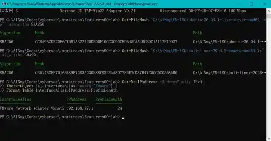
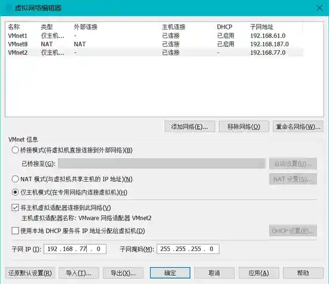

# S00-L01：Build Your Cyber Range

> 目标：先建立真实、隔离、可恢复的实验资产，再谈 Scope。后续所有主动安全实验都以这套 Cyber Range 为边界。

## 你要学会什么

完成本课后，你应该能解释并亲手验证：

- Host-Only、NAT、默认路由分别意味着什么；
- 为什么实验网络不能直接复用公司网、家庭 WLAN 或其他真实业务网；
- 为什么下载虚拟机/ISO 后要先做完整性校验；
- 如何给 Ubuntu 与 Kali 配置静态 IPv4；
- 如何证明实验 VM 默认不能访问公网；
- 为什么 Snapshot / Baseline 是后续可重复实验的前提。

## 安全边界

本课只搭建你自己拥有的本地虚拟实验环境，不对任何外部目标执行扫描或攻击。

**不要把真实 WLAN、公司网络、生产网络或“随便一个私网段”加入实验 Scope。私网地址不等于获得授权。**

## 参考拓扑，不是强制配置

本课程开发时使用下面的参考实现：

| 角色 | 参考配置 |
|---|---|
| VMware Host-Only | `VMnet2` / `192.168.77.0/24` |
| Windows Host | `192.168.77.1` |
| Ubuntu Target | `192.168.77.10` |
| Kali Tester | `192.168.77.20` |
| VMware DHCP | OFF |
| Guest default route | 无 |

你可以使用其他**专门为本课程创建、且不与现有网络冲突**的 Host-Only 网段。后续 S00-L02 必须把你实际使用的网段写入 Scope，而不是机械照抄 `192.168.77.0/24`。

## Step 1：从官方来源获取镜像

课程参考版本：

```text
Ubuntu Server 26.04.1 amd64
ubuntu-26.04.1-live-server-amd64.iso

Kali Linux 2026.2 VMware amd64
kali-linux-2026.2-vmware-amd64.7z
```

优先从 Ubuntu 官方 Releases 与 Kali 官方 Get Kali / Virtual Machines 页面获取，不从网盘、论坛附件或不明镜像站下载课程基础镜像。

## Step 2：校验 SHA256

本课程搭建时验证过的参考文件：

```text
Ubuntu Server 26.04.1 amd64
CC8A95CDE20F6CED61A322420DE00F10CC3C90CED545DAA46CB9C1A117F1D927

Kali Linux 2026.2 VMware amd64
C65145CEF70166889E7283A230E88C832EAA8077E6E7CD37B47C0CCDC05685B0
```

Windows PowerShell 可以执行：

```powershell
Get-FileHash .\ubuntu-26.04.1-live-server-amd64.iso -Algorithm SHA256
Get-FileHash .\kali-linux-2026.2-vmware-amd64.7z -Algorithm SHA256
```



> 真实截图：本课程开发环境中完成 Ubuntu/Kali SHA256 校验后，同时确认 Windows Host 的 VMnet2 地址为 `192.168.77.1/24`。

**不要把上面的历史 hash 当成未来版本的固定答案。** 每次下载都应查对应版本官方发布的 checksum，再和本地结果比较。

SHA256 匹配证明“本地文件与所比较的 checksum 对应文件一致”；如果需要进一步确认 checksum 发布者身份，还应验证官方提供的签名。二者不是同一个问题。

## Step 3：检查现有网络，避免撞网

在 Windows 主机先查看：

```powershell
ipconfig
Get-NetIPConfiguration
```

重点记录：

- 当前真实 WLAN / 以太网网段；
- VMware 已存在的 VMnet1 / VMnet8；
- Hyper-V / WSL 等虚拟网卡；
- 你准备创建的实验网段是否与上述网络重叠。

参考环境的真实 WLAN 是 `192.168.0.0/24`，因此课程没有把这个真实网络作为实验网段。

## Step 4：创建专用 Host-Only 网络

在 VMware Workstation 的 **Virtual Network Editor** 中新建一个专用 VMnet。

参考设置：

```text
VMnet2
Type: Host-only
Subnet: 192.168.77.0
Mask: 255.255.255.0
Connect a host virtual adapter: ON
Use local DHCP service: OFF
```



> 真实截图：`VMnet2` 使用 Host-Only，子网为 `192.168.77.0/24`，主机虚拟适配器开启，VMware DHCP 关闭。

DHCP 关闭后，我们后续可以明确知道每台实验资产的地址，不依赖动态分配。

在参考环境中，Windows 的 VMnet2 适配器为：

```text
192.168.77.1/24
```

## Step 5：安装 Ubuntu Target

参考 VM：

```text
Name: cyberlab-ubuntu
CPU: 2
RAM: 4 GB
Disk: 40 GB
Network: Custom / VMnet2
```

安装 Ubuntu Server 时把实验网卡设为静态地址，例如：

```text
IPv4: 192.168.77.10/24
Gateway: 留空
DNS: 留空
```

课程参考环境同时安装 OpenSSH Server，方便从 Windows 主机登录实验 VM。

安装完成后检查：

```bash
ip addr
ip route
sudo systemctl status ssh --no-pager
```

你应该看到实验网地址，但**不应该看到 `default via ...`**。

## Step 6：导入 Kali Tester

课程使用 Kali 官方 VMware 预构建镜像。导入后：

1. 修改默认密码；
2. 把网络适配器改为刚创建的 Host-Only VMnet；
3. 根据电脑资源调整 CPU/RAM；
4. 不给 Kali 添加第二块 NAT 网卡作为“方便联网”的长期配置。

参考环境：

```text
Name: cyberlab-kali
CPU: 4
RAM: 4 GB
Disk: 80 GB
Network: Custom / VMnet2
```

## Step 7：给 Kali 配置静态 IPv4

先查看 NetworkManager connection：

```bash
nmcli connection show
```

参考环境连接名为 `Wired connection 1`：

```bash
sudo nmcli connection modify "Wired connection 1" \
  ipv4.method manual \
  ipv4.addresses 192.168.77.20/24 \
  ipv4.gateway "" \
  ipv4.dns "" \
  ipv4.never-default yes

sudo nmcli connection down "Wired connection 1"
sudo nmcli connection up "Wired connection 1"
```

验证：

```bash
ip addr show
ip route
```

参考结果只有直连路由：

```text
192.168.77.0/24 dev eth0 ... src 192.168.77.20
```

没有 `default` 路由。

## Step 8：做三节点连通性矩阵

至少完成以下方向：

```text
Windows Host  → Ubuntu
Windows Host  → Kali
Ubuntu        → Windows Host
Ubuntu        → Kali
Kali          → Windows Host
Kali          → Ubuntu
```

Linux：

```bash
ping -c 4 192.168.77.1
ping -c 4 192.168.77.10
ping -c 4 192.168.77.20
```

Windows：

```powershell
ping 192.168.77.10
ping 192.168.77.20
```

参考环境六个方向都验证通过。

## Step 9：证明“默认隔离”，不要只凭感觉

Ubuntu 与 Kali 都执行：

```bash
ip route
ping -c 2 8.8.8.8
```

本课期望：

```text
ip route        → 没有 default route
ping 8.8.8.8    → 失败
```

这里用 IP 直连测试，是为了把“没有公网路由”与“DNS 配错”区分开。

如果未来确实需要联网更新软件，应把 NAT 作为**临时维护动作**：临时启用、完成更新、关闭，再重新验证隔离状态。不要让课程攻击实验长期同时连接 Host-Only 与 NAT。

## Step 10：建立 Baseline Snapshot

在开始后续 Lab 前，为两台 VM 建立基线快照。参考命名：

```text
S00-UBUNTU-BASELINE
S00-KALI-BASELINE
```

Snapshot 的意义不是“备份一切”，而是给实验建立一个可快速返回、可重复验证的已知状态。

## Troubleshooting：Kali 鼠标能点但光标不可见

课程搭建时遇到过一个真实问题：Kali 官方预构建 VM 中鼠标点击有效，但指针不可见。

本次案例最终发现 `.vmx` 中存在较旧的：

```text
virtualHW.version = "8"
```


> 真实排障截图（已裁剪脱敏）：该预构建 VM 显示为较旧的 Workstation 8.x 虚拟硬件兼容级别。

通过 VMware：

```text
VM → Manage → Change Hardware Compatibility
```

升级到当前 Workstation 支持的硬件兼容级别后，光标恢复正常。

**这是本次环境的排障结论，不应推导成“所有 Kali 光标问题都由 virtualHW.version=8 导致”。** 其他环境仍需根据症状、VMware 版本、Guest Tools、显示设置逐项排查。

## Gate：S00-L01 通过条件

只有下面全部成立，才进入 Scope：

1. Ubuntu / Kali / Windows Host 在专用 Host-Only 实验网内按计划互通；
2. Ubuntu 与 Kali 的 `ip route` 均没有 `default` route；
3. Ubuntu 与 Kali 直接 `ping 8.8.8.8` 失败；
4. 你能解释 Host-Only 与 NAT 的核心差异；
5. Ubuntu 与 Kali 都创建了 baseline snapshot；
6. 你能解释为什么真实 WLAN 或其他私网不能因为“是私网”就自动进入安全实验 Scope；
7. 你记录了自己实际使用的 Host-Only 网段，下一课将用它创建 allowlist。

## Checkpoint

新课程结构完成本课后创建：

```text
s00-l01-complete-v2
```

旧的 `s00-l01-complete` 属于重构前 Scope Lab 的历史 checkpoint，不移动、不覆盖。
